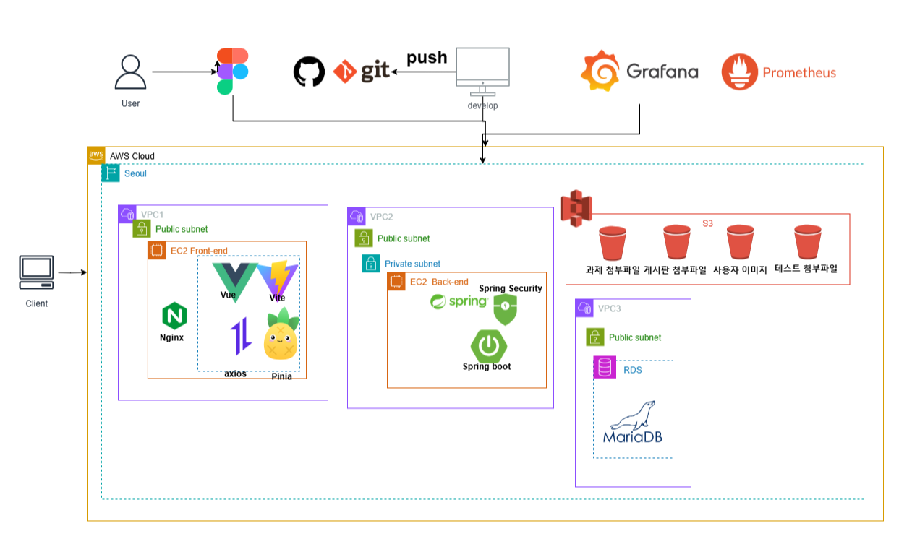

# be12-3rd-404Error-EduLink

## 📌 프로젝트 주제 

      

### EduLink: 혁신적인 학습 관리 플랫폼
빠르게 증가하는 국비지원 부트캠프 수요에 맞춰 학습 환경의 질적 향상을 목표로 개발된 EduLink는 기존 LMS(HRD-Net)의 한계를 보완합니다.   

이 플랫폼은 단순 출결 확인을 넘어 커리큘럼 관리, 공지사항 통합, 학습 성과 분석 등 다양한 기능을 통해 학습 효율을 극대화합니다.   

수강생들은 EduLink를 통해 학습 전반을 체계적으로 관리하고 편리하게 활용할 수 있습니다.

[상세보기](https://github.com/beyond-sw-camp/be12-1st-404Error-EduLink/blob/main/README.md)

## 💡팀

    
    <h3>한화시스템 BEYOND SW캠프 </h3>
    
12기 2차 프로젝트 <strong>팀 404Error</strong>

## 🤚 404Error 팀원

  <table  align="center">
    <tbody>
      <tr>
        <td align="center"><a href="https://github.com/museongkim0" style="text-decoration: none; color: lightgray;"> <b> 🐯 김무성</b></a> </td>
        <td align="center"><a href="https://github.com/kuj7882" style="text-decoration: none; color: lightgray;"> <b> 🐶 김유진</b></a> </td>
        <td align="center"><a href="https://github.com/GoodLeaf" style="text-decoration: none; color: lightgray;"> <b> 🐺 김정엽</b></a> </td>
        <td align="center"><a href="https://github.com/gunha0405" style="text-decoration: none; color: lightgray;"> <b> 🐱 오건하</b></a> </td>
        <td align="center"><a href="https://github.com/leewoojin12" style="text-decoration: none; color: lightgray;"> <b> 🦁 이우진</b></a> </td>
      </tr>
    </tbody>
  </table>

## ⭐ 접속 주소
[www.edulink.kro.kr](http://www.edulink.kro.kr)

## 🔧 기술 스택
프론트엔드  
 
 
  

백엔드  
   

DB 
 
 
<!--     -->

클라우드  
 
 

협업 툴  
 

 

## 🔧 시스템 아키텍처
 

 Amazon RDS 

 
- 별도의 설치과정 및 서버 IP & PORT 설정 없이 DB를 구성하기 위해 Amazon RDS를 사용하였습니다.

 Amazon S3 

- 사용자 이미지 파일, 게시판 첨부 파일, 과제 첨부 파일, 테스트 첨부 파일 등 서비스에 필요한 파일을 저장하기 위해 S3를 사용하였습니다.

 EC2 

- 2대의 EC2를 이용하여 한대는 프론트서버, 한대는 백엔드 서버를 설정하였습니다. 

## ⭐ 소프트웨어 아키텍처
<!-- [www.edulink.kro.kr](http://www.edulink.kro.kr) -->

## ⭐ 코딩 커벤션션
<!-- [www.edulink.kro.kr](http://www.edulink.kro.kr) -->

## ⭐ API 명세서
<!-- [www.edulink.kro.kr](http://www.edulink.kro.kr) -->

## ⭐ 기능 테스트
<!-- [www.edulink.kro.kr](http://www.edulink.kro.kr) -->

## ⭐ 성능 개선
<!-- [www.edulink.kro.kr](http://www.edulink.kro.kr) -->