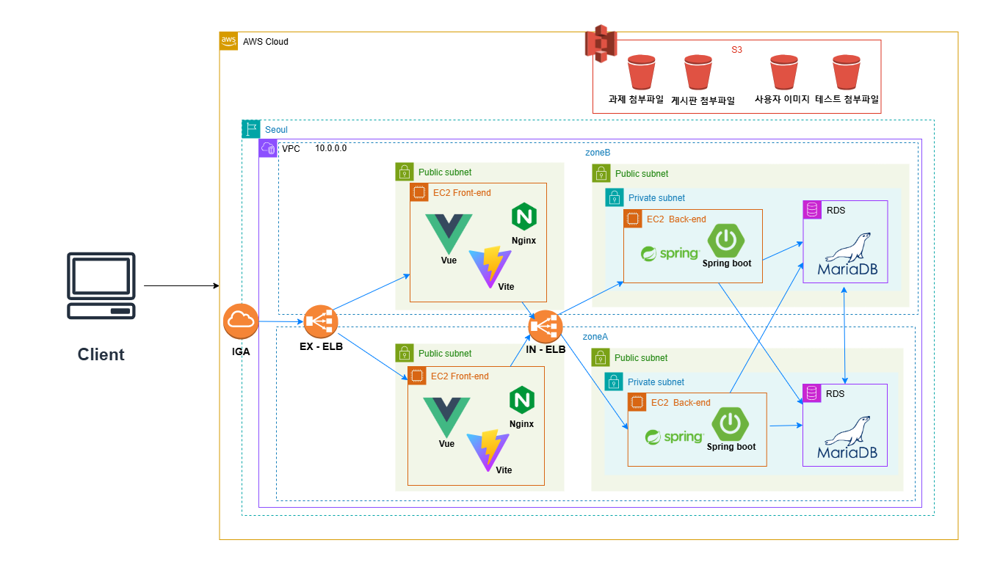

# be12-3rd-404Error-EduLink

## 📌 프로젝트 주제 

      

### EduLink: 혁신적인 학습 관리 플랫폼
빠르게 증가하는 국비지원 부트캠프 수요에 맞춰 학습 환경의 질적 향상을 목표로 개발된 EduLink는 기존 LMS(HRD-Net)의 한계를 보완합니다.   

이 플랫폼은 단순 출결 확인을 넘어 커리큘럼 관리, 공지사항 통합, 학습 성과 분석 등 다양한 기능을 통해 학습 효율을 극대화합니다.   

수강생들은 EduLink를 통해 학습 전반을 체계적으로 관리하고 편리하게 활용할 수 있습니다.

[상세보기](https://github.com/beyond-sw-camp/be12-3rd-404Error-EduLink/wiki/1.-%ED%94%84%EB%A1%9C%EC%A0%9D%ED%8A%B8-%EA%B0%9C%EC%9A%94)

## 💡팀

    
    <h3>한화시스템 BEYOND SW캠프 </h3>
    
12기 2차 프로젝트 <strong>팀 404Error</strong>

## 🤚 404Error 팀원

  <table  align="center">
    <tbody>
      <tr>
        <td align="center"><a href="https://github.com/museongkim0" style="text-decoration: none; color: lightgray;"> <b> 🯠김무성</b></a> </td>
        <td align="center"><a href="https://github.com/kuj7882" style="text-decoration: none; color: lightgray;"> <b> 🶠김유진</b></a> </td>
        <td align="center"><a href="https://github.com/GoodLeaf" style="text-decoration: none; color: lightgray;"> <b> 🺠김정엽</b></a> </td>
        <td align="center"><a href="https://github.com/gunha0405" style="text-decoration: none; color: lightgray;"> <b> 🱠오건하</b></a> </td>
        <td align="center"><a href="https://github.com/leewoojin12" style="text-decoration: none; color: lightgray;"> <b> 🦠ì´ìš°ì§„</b></a> </td>
      </tr>
    </tbody>
  </table>

## ⭐ 접속 주소
<h3>
  <a href="http://www.edulink.kro.kr">www.edulink.kro.kr</a>
</h3>

## 🔧 기술 스택
프론트엔드  
 
 
  

백엔드  
   

DB 
 
 
<!--     -->

클라우드  
 
 

협업 툴  
 

 

## 🖥️ 시스템 아키텍처
 

 Amazon RDS 

 
- 별도의 설치과정 및 서버 IP & PORT 설정 없이 DB를 구성하기 위해 Amazon RDS를 사용하였습니다.

 Amazon S3 

- 사용자 이미지 파일, 게시판 첨부 파일, 과제 첨부 파일, 테스트 첨부 파일 등 서비스에 필요한 파일을 크기 제한 없이 저장하기 위해 S3를 사용하였습니다.

 EC2 

- 유연한 서버 관리를 위해 2대의 EC2를 이용하여 한대는 프론트서버, 한대는 백엔드 서버를 설정하였습니다. 

 ELB 

- 여러 서버에 요청을 분산하여 서버 과부하를 방지하고, 부하를 균등하게 분배하기 위해 ELB를 사용하였습니다. 

## 👩‍💻 소프트웨어 아키텍처
 
<a href="https://github.com/beyond-sw-camp/be12-3rd-404Error-EduLink/wiki/2.-SW-%EC%95%84%ED%82%A4%ED%85%8D%EC%B3%90">소프트웨어 아키텍처</a>

## ⌨️ 코딩 커벤션
<a href="https://github.com/beyond-sw-camp/be12-3rd-404Error-EduLink/wiki/3.-%EC%BD%94%EB%94%A9-%EC%BB%A8%EB%B2%A4%EC%85%98">코딩 커벤션</a>

## 📃 API 명세서
<a href="http://13.209.73.133:8080/swagger-ui/index.html">API 명세서</a>

<!-- ## ⭐ 시퀀스 다이어그램
<a href="https://github.com/beyond-sw-camp/be12-3rd-404Error-EduLink/wiki/SW-%EC%95%84%ED%82%A4%ED%85%8D%EC%B3%90">API 명세서</a> -->

## 🔎 기능 테스트
<a href="https://github.com/beyond-sw-camp/be12-3rd-404Error-EduLink/wiki/4.-%EA%B8%B0%EB%8A%A5-%ED%85%8C%EC%8A%A4%ED%8A%B8">기능 테스트</a>

## 🚀 성능 개선
<a href="https://github.com/beyond-sw-camp/be12-3rd-404Error-EduLink/wiki/5.-%EC%84%B1%EB%8A%A5-%EA%B0%9C%EC%84%A0">성능 개선</a>